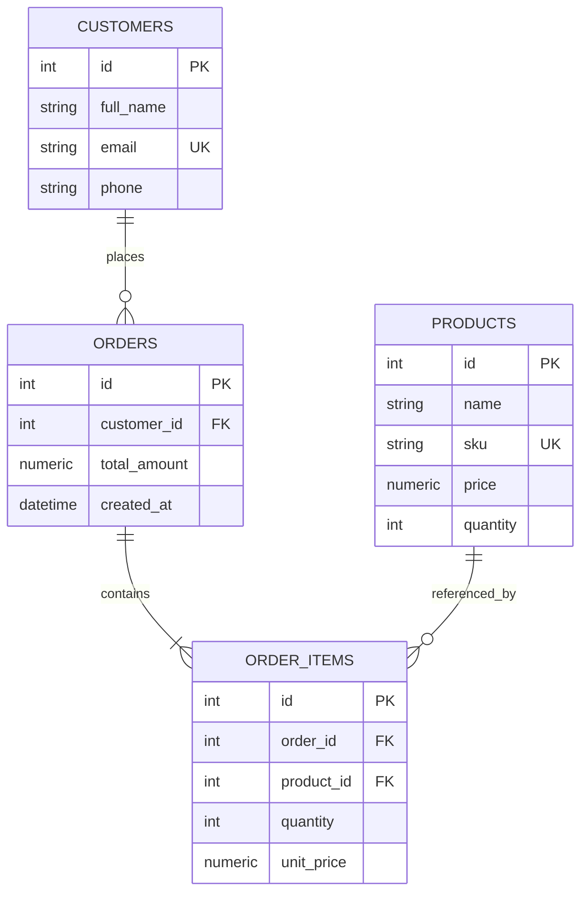

# Database Design

## ER Diagram

## Table Definitions

### `products`

| Column | Type | Constraints |
| --- | --- | --- |
| `id` | integer | Primary key |
| `name` | varchar(255) | Not null |
| `sku` | varchar(100) | Not null, unique |
| `price` | numeric(12, 2) | Not null, `price >= 0` |
| `quantity` | integer | Not null, default `0`, `quantity >= 0` |

### `customers`

| Column | Type | Constraints |
| --- | --- | --- |
| `id` | integer | Primary key |
| `full_name` | varchar(255) | Not null |
| `email` | varchar(320) | Not null, unique |
| `phone` | varchar(30) | Nullable |

### `orders`

| Column | Type | Constraints |
| --- | --- | --- |
| `id` | integer | Primary key |
| `customer_id` | integer | Not null, foreign key to `customers.id` |
| `total_amount` | numeric(12, 2) | Not null, `total_amount >= 0` |
| `created_at` | timestamp with time zone | Not null, defaults to current time |

### `order_items`

| Column | Type | Constraints |
| --- | --- | --- |
| `id` | integer | Primary key |
| `order_id` | integer | Not null, foreign key to `orders.id` |
| `product_id` | integer | Not null, foreign key to `products.id` |
| `quantity` | integer | Not null, `quantity > 0` |
| `unit_price` | numeric(12, 2) | Not null, `unit_price >= 0` |

## Relationships

- One customer can have many orders.
- One order belongs to exactly one customer.
- One order contains one or more order items.
- One order item references exactly one product.
- One product can appear in many order items over time.

## Index Strategy

- Unique index on `products.sku` for product lookup and uniqueness enforcement.
- Unique index on `customers.email` for customer lookup and uniqueness enforcement.
- Index on `orders.customer_id` for customer order history queries.
- Index on `orders.created_at` for chronological listing and reporting.
- Index on `order_items.order_id` for loading order details.
- Index on `order_items.product_id` for product sales analytics.
- Optional index on `products.quantity` if low-stock dashboard queries become hot.

## Constraints

- `products.sku` is unique.
- `customers.email` is unique.
- `products.quantity >= 0`.
- `products.price >= 0`.
- `orders.total_amount >= 0`.
- `order_items.quantity > 0`.
- `order_items.unit_price >= 0`.
- Foreign keys preserve referential integrity between customers, orders, order items, and products.

## Future Scalability Notes

- Add soft deletes for products and customers if historical visibility and catalog cleanup need to coexist.
- Add idempotency keys to order creation to protect clients from accidental duplicate submissions.
- Add inventory movement records for auditable stock changes.
- Add optimistic versioning or stricter isolation for high-concurrency inventory workloads.
- Add read models or cached aggregates if dashboard queries become expensive.
- Add partitioning for very large orders and order items tables.

