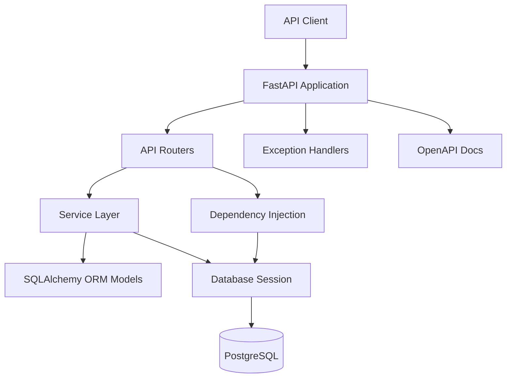
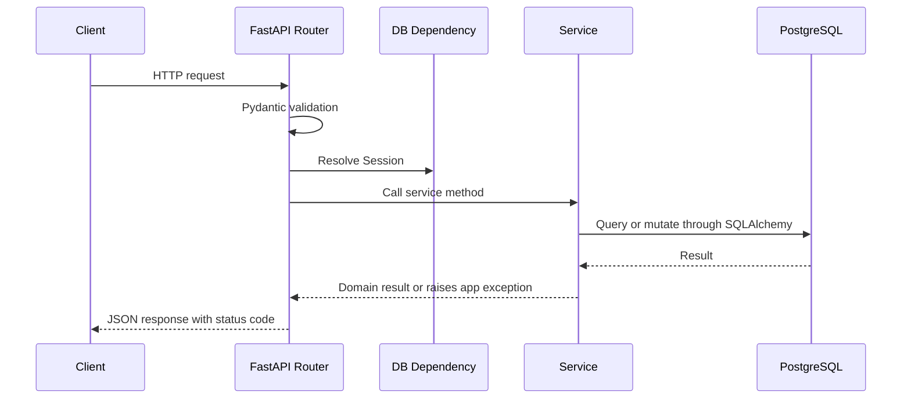
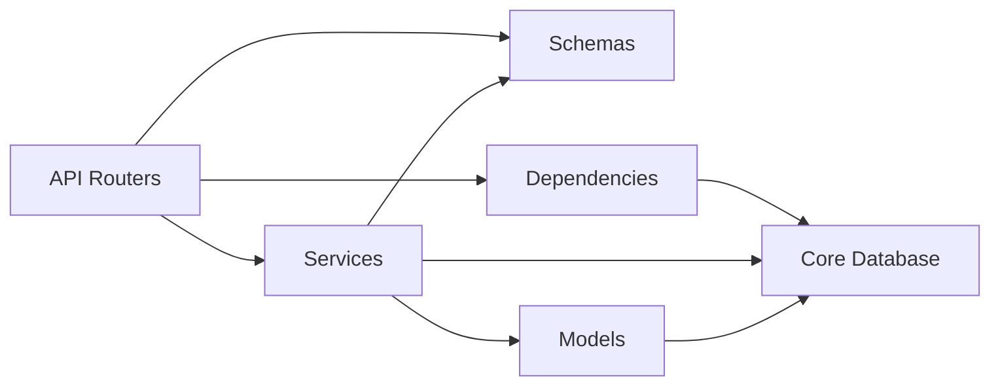

# System Architecture

## Architecture Diagram



## Layer Responsibilities

| Layer | Responsibility |
| --- | --- |
| `app/main.py` | Application factory, router registration, middleware, exception handlers, health endpoint |
| `app/api` | Route declarations, request/response models, status codes, dependency wiring |
| `app/services` | Business rules, persistence orchestration, transaction boundaries |
| `app/models` | SQLAlchemy table mappings, relationships, indexes, constraints |
| `app/schemas` | Pydantic request/response validation and OpenAPI examples |
| `app/core` | Configuration, engine/session setup, custom exception types and handlers |
| `app/dependencies` | Reusable FastAPI dependencies |
| `tests` | API and service behavior verification |
| `alembic` | Database schema migration management |

## Request Flow



For order creation, the service opens a transaction, locks product rows for update, validates stock, creates the order and items, decrements inventory, and commits atomically.

## Dependency Flow



Dependencies point inward. Routers know about services and schemas. Services know about models, schemas, and database sessions. Models do not import routers or services.

## Folder Structure

```text
backend/
├── app/
│   ├── api/
│   ├── core/
│   ├── dependencies/
│   ├── models/
│   ├── schemas/
│   ├── services/
│   └── main.py
├── tests/
├── alembic/
├── alembic.ini
├── docker-compose.yml
├── Dockerfile
├── requirements.txt
└── README.md
```

## Scalability Considerations

- Add pagination defaults and maximum limits on list endpoints to avoid unbounded reads.
- Keep order creation transactional and use row-level locking to prevent overselling under concurrent requests.
- Index unique identifiers and foreign keys used for lookup, filtering, and joins.
- Use fixed precision numeric columns for prices and totals.
- Preserve order history by storing order item unit price instead of recalculating from mutable product prices.
- Keep services isolated so future integrations, async jobs, or separate modules can be introduced without rewriting routers.
- Use Alembic migrations instead of runtime `create_all` for production schema evolution.
- Use stateless application containers that can scale horizontally behind a load balancer.

